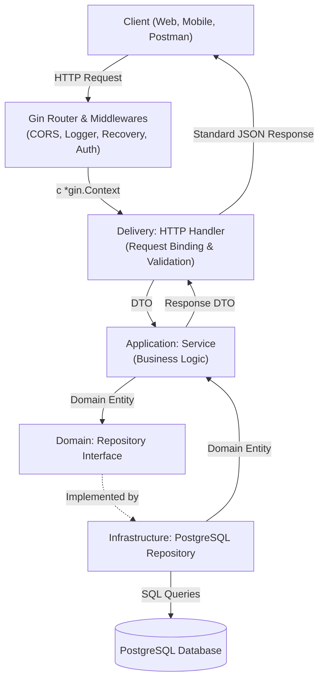

# Next Store API

A high-performance backend RESTful API built with **Go (Golang)** using a **Feature-Modular Clean Architecture** pattern. This architecture is designed for clear separation of concerns, high testability, and effortless scalability as new domain features are added. Database migrations are managed reliably using **Goose**.

---

## 📌 Table of Contents

- [Key Features](#-key-features)
- [Tech Stack & Libraries](#-tech-stack--libraries)
- [Architecture Overview](#-architecture-overview)
  - [Design Principles](#design-principles)
  - [Directory Structure](#directory-structure)
  - [Data Flow Diagram](#data-flow-diagram)
- [System Prerequisites](#-system-prerequisites)
- [Getting Started & Development Setup](#-getting-started--development-setup)
  - [1. Clone Repository](#1-clone-repository)
  - [2. Environment Configuration](#2-environment-configuration)
  - [3. Start PostgreSQL Database](#3-start-postgresql-database)
  - [4. Run Database Migrations (Goose)](#4-run-database-migrations-goose)
  - [5. Run Database Seeders (Optional)](#5-run-database-seeders-optional)
  - [6. Run the API Server](#6-run-the-api-server)
- [Database Migrations with Goose](#-database-migrations-with-goose)
- [Database Seeding](#-database-seeding)
- [Makefile Commands](#-makefile-commands)
- [API Endpoints Reference](#-api-endpoints-reference)
  - [Standard API Response Format](#standard-api-response-format)
  - [Health Check Endpoints](#health-check-endpoints)
  - [Authentication Endpoints](#authentication-endpoints)
  - [User Endpoints (Protected by Bearer Token)](#user-endpoints-protected-by-bearer-token)
- [Testing & Code Quality](#-testing--code-quality)

---

## 🚀 Key Features

- **Feature-Modular Clean Architecture**: Domain features (`auth`, `user`, `health`) are strictly segregated into feature modules, each divided into `domain`, `application`, `infrastructure`, and `delivery` layers.
- **Database Migrations with Goose**: Declarative SQL migrations with versioning, rollback support (`-- +goose Up` / `-- +goose Down`), and status inspection.
- **Authentication & Security**: Secure user registration, password hashing with **bcrypt**, and stateless authorization using **JSON Web Tokens (JWT)**.
- **Database Connection Pooling**: PostgreSQL connection pool configured via the high-performance **pgx/v5** driver using Go's standard `database/sql` interface.
- **Graceful Shutdown**: Safely drains active HTTP requests and closes database connections upon receiving OS termination signals (`SIGINT`, `SIGTERM`).
- **Standardized API Responses**: Predictable JSON response envelopes across all endpoints for both success and error responses.
- **Pagination & Input Validation**: Reusable helpers for offset-based pagination and validation error mapping via `go-playground/validator`.
- **Docker Compose Integration**: Out-of-the-box local database container with healthcheck and persistent volumes.

---

## 🛠 Tech Stack & Libraries

| Library / Tool | Version | Purpose & Rationale |
| :--- | :--- | :--- |
| **[Go](https://go.dev/)** | `1.22+` / `1.27` | Core programming language offering high throughput, memory safety, and first-class concurrency. |
| **[Gin Web Framework](https://github.com/gin-gonic/gin)** | `v1.12.0` | Ultra-fast HTTP web framework with flexible routing, JSON binding, and middleware chain. |
| **[Goose](https://github.com/pressly/goose)** | `v3.28.0` | Production-grade database migration tool supporting raw SQL scripts and version control. |
| **[pgx](https://github.com/jackc/pgx/v5)** | `v5.11.0` | High-performance pure-Go PostgreSQL driver and toolkit integrating smoothly with `database/sql`. |
| **[golang-jwt](https://github.com/golang-jwt/jwt/v5)** | `v5.3.1` | Robust JWT implementation for signing and verifying HMAC-SHA256 authentication tokens. |
| **[bcrypt](https://pkg.go.dev/golang.org/x/crypto/bcrypt)** | `v0.48.0` | Cryptographic adaptive hashing algorithm for storing passwords securely. |
| **[godotenv](https://github.com/joho/godotenv)** | `v1.5.1` | Automatically loads configuration parameters from `.env` files into environment variables. |
| **[validator](https://github.com/go-playground/validator/v10)** | `v10.30.1` | Struct and field validation for request DTO payloads with granular error mapping. |
| **[uuid](https://github.com/google/uuid)** | `v1.6.0` | Generates unique UUID v4 identifiers for domain entities. |
| **[golangci-lint](https://golangci-lint.run/)** | Latest | Comprehensive static analysis and linting aggregator to enforce Go code standards. |

---

## 🏛 Architecture Overview

### Design Principles

This project combines **Clean Architecture** with a **Feature-Modular** layout:
1. **Domain Layer**: The enterprise core. Contains pure business models, entities, and repository interfaces. Has zero dependencies on external frameworks or databases.
2. **Application Layer**: Contains business logic orchestration, use cases, services, and Data Transfer Objects (DTOs).
3. **Infrastructure Layer**: Technical implementations of repository interfaces (PostgreSQL database queries, external integrations).
4. **Delivery Layer**: The entry point for transport protocols (HTTP Gin handlers, route definitions, parameter parsing).

### Directory Structure

```text
my-project/
├── cmd/
│   ├── api/
│   │   └── main.go                     # Application entry point, DI, and graceful shutdown
│   └── seeder/
│       └── main.go                     # Database seeder CLI entry point
│
├── internal/                           # Private code not accessible by external Go modules
│   ├── config/                         # Environment parsing and typed app config
│   ├── database/                       # PostgreSQL connection pool initializer
│   ├── server/                         # HTTP server lifecycle and Gin router configuration
│   ├── middleware/                     # Middleware (JWT Auth, CORS, Request Logger, Recovery)
│   ├── seeder/                         # Database seeders (Registry, UserSeeder)
│   ├── shared/                         # Shared utilities across modules
│   │   ├── response/                   # Standardized JSON response envelope
│   │   ├── pagination/                 # Query pagination parser and metadata builder
│   │   ├── validator/                  # Request binding error formatter
│   │   └── errors/                     # AppError types with HTTP status mappings
│   │
│   └── modules/                        # Feature-modular domain components
│       ├── auth/                       # Authentication feature module
│       │   ├── domain/                 # Auth entities & repository interface
│       │   ├── application/            # Auth DTOs & business logic (Service)
│       │   ├── infrastructure/         # PostgreSQL session repository
│       │   └── delivery/http/          # HTTP handlers & route definitions
│       │
│       ├── user/                       # User management feature module
│       │   ├── domain/                 # User entity & UserRepository interface
│       │   ├── application/            # User DTOs & UserService
│       │   ├── infrastructure/         # PostgreSQL UserRepository implementation
│       │   └── delivery/http/          # HTTP handlers & route definitions
│       │
│       └── health/                     # Health & Readiness check module
│           └── delivery/http/          # Health HTTP handler
│
├── migrations/                         # Goose SQL migration files (e.g. 00001_create_users_table.sql)
├── tests/                              # Integration & E2E tests
│   └── integration/
│
├── .env                                # Local environment settings (git-ignored)
├── .env.example                        # Template for environment settings
├── .gitignore                          # Git ignore specification
├── .golangci.yml                       # GolangCI linter configuration
├── docker-compose.yml                  # PostgreSQL database container definition
├── go.mod                              # Go module specifications
├── go.sum                              # Dependency checksums
└── Makefile                            # Automation tasks for build, test, migrations, and run
```

### Data Flow Diagram



---

## 💻 System Prerequisites

Before starting, ensure your system has the following tools installed:
- **Go**: version `1.22` or later (`go version`)
- **Docker** & **Docker Compose**: to run the PostgreSQL container locally
- **Make**: for executing Makefile tasks (recommended)
- **Git**

---

## 📦 Getting Started & Development Setup

### 1. Clone Repository

```bash
git clone https://github.com/ramdhanrizkij/next-store-api.git
cd next-store-api
```

### 2. Environment Configuration

Copy the sample environment file to `.env`:

```bash
cp .env.example .env
```

Review and adjust variables in `.env` if necessary. The default values work seamlessly with the included `docker-compose.yml`:

```env
# Application Configuration
APP_NAME=next-store-api
APP_ENV=development
APP_PORT=8080
APP_URL=http://localhost:8080

# Database Configuration (PostgreSQL)
DB_HOST=localhost
DB_PORT=5432
DB_USER=postgres
DB_PASSWORD=postgres
DB_NAME=nextstore
DB_SSLMODE=disable
DB_MAX_OPEN_CONNS=25
DB_MAX_IDLE_CONNS=25
DB_CONN_MAX_LIFETIME=15

# JWT Authentication
JWT_SECRET=supersecretjwtkeychangeinproduction
JWT_EXPIRATION_HOURS=24
```

### 3. Start PostgreSQL Database

Launch the PostgreSQL container using Docker Compose:

```bash
make docker-up
# Or directly via docker compose:
docker compose up -d
```

Verify that the database container is healthy:

```bash
docker compose ps
```

### 4. Run Database Migrations (Goose)

Apply all pending schema migrations:

```bash
make migrate-up
```

You can inspect the migration status at any time:

```bash
make migrate-status
```

### 5. Run Database Seeders (Optional)

Populate the database with initial demo data (e.g. system admin and customer accounts):

```bash
make seed
# Or directly via Go CLI:
go run ./cmd/seeder
```

### 6. Run the API Server

Start the application in development mode:

```bash
make run
# Or directly with the Go CLI:
go run ./cmd/api
```

Upon successful startup, the server output will display:

```text
Starting next-store-api in development mode...
Database connection established successfully
HTTP Server is listening on port 8080
```

---

## 🗄 Database Migrations with Goose

Database migrations are located in the `migrations/` folder and formatted for **Goose**.

### Migration File Structure

Each migration file contains both the forward (`Up`) and rollback (`Down`) instructions:

```sql
-- +goose Up
-- +goose StatementBegin
CREATE TABLE users ( ... );
-- +goose StatementEnd

-- +goose Down
-- +goose StatementBegin
DROP TABLE users;
-- +goose StatementEnd
```

### Goose Migration Commands

| Command | Description |
| :--- | :--- |
| `make migrate-up` | Run all pending migrations |
| `make migrate-down` | Rollback the most recent migration |
| `make migrate-status` | Display applied vs pending migrations |
| `make migrate-reset` | Rollback all migrations to initial state |
| `make migrate-create name=<migration_name>` | Create a new SQL migration file (e.g., `make migrate-create name=create_products_table`) |

---

## 🌱 Database Seeding

Database seeders are implemented in Go under `internal/seeder/` and run through the CLI entry point `cmd/seeder/main.go`.

### Running Seeders

Execute the seeder command:

```bash
make seed
# Or directly:
go run ./cmd/seeder
```

Seeders are **idempotent** (`ON CONFLICT (email) DO NOTHING`), meaning they can be run multiple times safely without creating duplicates.

### Default Seed Accounts

| Account | Email | Password | Role |
| :--- | :--- | :--- | :--- |
| **System Admin** | `admin@nextstore.com` | `adminpassword123` | `admin` |
| **Customer** | `customer@nextstore.com` | `customerpassword123` | `user` |

---

## ⌨️ Makefile Commands

A comprehensive suite of shortcuts is available via `make`:

| Command | Description |
| :--- | :--- |
| `make run` / `make dev` | Run the application from source code |
| `make build` | Compile the application binary into `./bin/app` |
| `make start` | Build and run the compiled binary |
| `make test` | Run all unit and integration tests |
| `make test-cover` | Run tests with coverage profile and open HTML report |
| `make lint` | Run `golangci-lint` static code analysis |
| `make fmt` | Format all Go code files using `go fmt` |
| `make vet` | Examine Go source code for suspicious constructs using `go vet` |
| `make tidy` | Download missing dependencies and clean up `go.mod` |
| `make clean` | Remove the `./bin` directory and coverage artifacts |
| `make docker-up` | Start the PostgreSQL container in the background |
| `make docker-down` | Stop and remove the Docker containers |
| `make docker-logs` | Follow real-time logs from Docker containers |
| `make migrate-up` | Apply pending Goose migrations to PostgreSQL |
| `make migrate-down` | Rollback the last Goose migration |
| `make migrate-status` | Print current Goose migration status |
| `make migrate-reset` | Revert all applied Goose migrations |
| `make migrate-create name=...` | Generate a new timestamped migration file |
| `make seed` | Populate the database with initial seed data |
| `make db-info` | Display database configuration loaded from `.env` |

---

## 📡 API Endpoints Reference

### Standard API Response Format

All responses follow a consistent envelope structure:

**Success Response:**
```json
{
  "success": true,
  "message": "Descriptive message",
  "data": { ... },
  "meta": { ... } // Present on paginated endpoints
}
```

**Error Response:**
```json
{
  "success": false,
  "message": "Error description",
  "errors": { ... }
}
```

---

### Health Check Endpoints

#### 1. Ping
- **Endpoint**: `GET /ping`
- **Description**: Lightweight health probe.
- **Response (200 OK)**:
```json
{
  "success": true,
  "message": "Pong",
  "data": {
    "status": "healthy"
  }
}
```

#### 2. Health & Database Status
- **Endpoint**: `GET /health`
- **Description**: Checks service readiness and PostgreSQL connection state.
- **Response (200 OK)**:
```json
{
  "success": true,
  "message": "Service is healthy",
  "data": {
    "app": "next-store-api",
    "database": "connected",
    "status": "running",
    "timestamp": "2026-09-29T12:45:00Z"
  }
}
```

---

### Authentication Endpoints

Base path: `/api/v1/auth`

#### 1. Register User
- **Endpoint**: `POST /api/v1/auth/register`
- **Request Body**:
```json
{
  "name": "John Doe",
  "email": "john@example.com",
  "password": "password123"
}
```
- **Response (201 Created)**:
```json
{
  "success": true,
  "message": "User registered successfully",
  "data": {
    "user": {
      "id": "1e15fa5c-197e-40e1-bbcb-e80ea057a627",
      "name": "John Doe",
      "email": "john@example.com",
      "role": "user",
      "created_at": "2026-09-29T12:00:00Z",
      "updated_at": "2026-09-29T12:00:00Z"
    },
    "access_token": "eyJhbGciOiJIUzI1Ni...",
    "token_type": "Bearer",
    "expires_at": "2026-09-30T12:00:00Z"
  }
}
```

#### 2. Login User
- **Endpoint**: `POST /api/v1/auth/login`
- **Request Body**:
```json
{
  "email": "john@example.com",
  "password": "password123"
}
```
- **Response (200 OK)**:
```json
{
  "success": true,
  "message": "Login successful",
  "data": {
    "user": {
      "id": "1e15fa5c-197e-40e1-bbcb-e80ea057a627",
      "name": "John Doe",
      "email": "john@example.com",
      "role": "user",
      "created_at": "2026-09-29T12:00:00Z",
      "updated_at": "2026-09-29T12:00:00Z"
    },
    "access_token": "eyJhbGciOiJIUzI1Ni...",
    "token_type": "Bearer",
    "expires_at": "2026-09-30T12:00:00Z"
  }
}
```

---

### User Endpoints (Protected by Bearer Token)

All endpoints below require an `Authorization` header:
```http
Authorization: Bearer <access_token>
```

| Method | Endpoint | Description |
| :--- | :--- | :--- |
| `GET` | `/api/v1/users/me` | Retrieve the authenticated user's profile |
| `PUT` | `/api/v1/users/me` | Update the authenticated user's name (`name`) |
| `GET` | `/api/v1/users?page=1&limit=10` | Retrieve paginated list of users |
| `GET` | `/api/v1/users/:id` | Retrieve user details by ID |
| `DELETE` | `/api/v1/users/:id` | Delete user by ID |

---

## 🧪 Testing & Code Quality

Execute the test suite (unit tests and integration tests):

```bash
make test
```

Generate and view HTML code coverage reports:

```bash
make test-cover
```

Run linter checks using `golangci-lint`:

```bash
make lint
```
