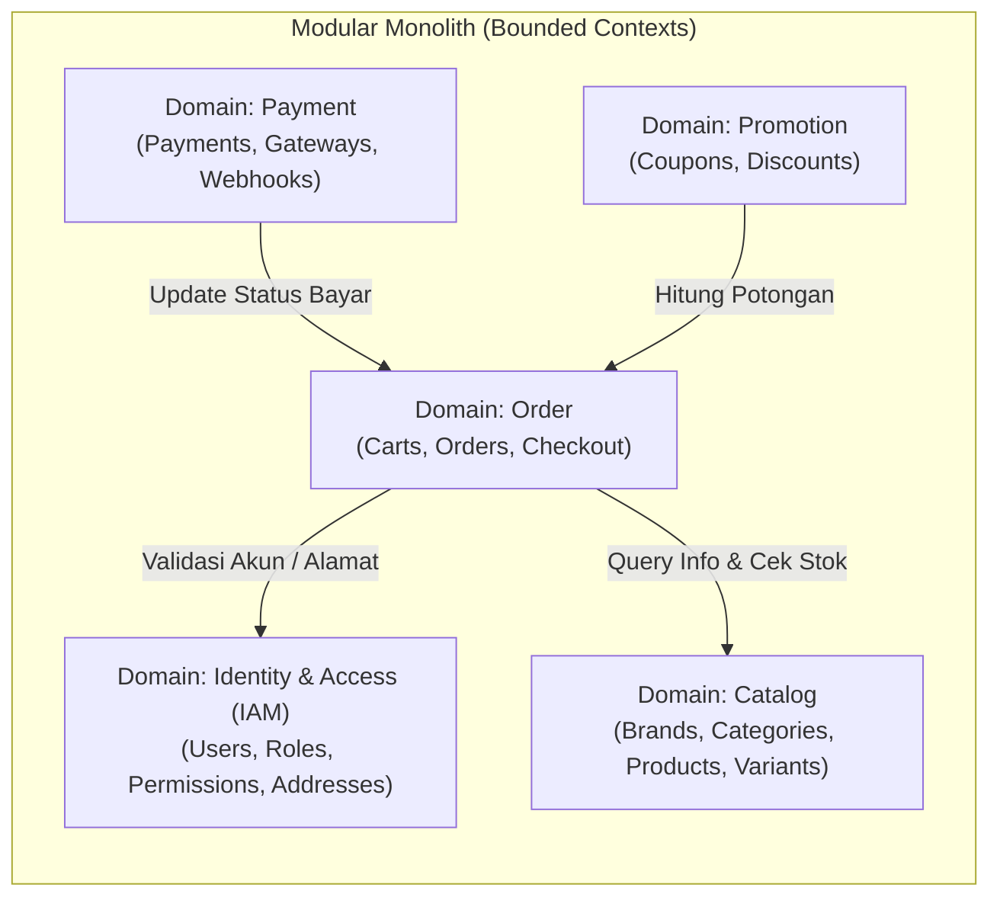

# Panduan Desain Arsitektur & Code Style (Domain-Driven Modular Monolith)

Dokumen ini menjelaskan rancangan struktur folder, pemisahan domain (bounded context), dan panduan gaya kode (*code style & conventions*) untuk **Next Store API**.

---

## 📌 Daftar Isi

1. [Latar Belakang & Filosofi Desain](#1-latar-belakang--filosofi-desain)
2. [Pemetaan Domain (Bounded Contexts)](#2-pemetaan-domain-bounded-contexts)
3. [Rancangan Struktur Folder Proyek](#3-rancangan-struktur-folder-proyek)
4. [Tanggung Jawab Tiap Layer (Clean Architecture)](#4-tanggung-jawab-tiap-layer-clean-architecture)
5. [Prinsip Desain & Aturan Komunikasi Antar Domain](#5-prinsip-desain--aturan-komunikasi-antar-domain)
6. [Konvensi & Code Style di Go](#6-konvensi--code-style-di-go)
7. [Contoh Pola Kode per Layer](#7-contoh-pola-kode-per-layer)
8. [Panduan Migrasi dari Struktur Lama](#8-panduan-migrasi-dari-struktur-lama)

---

## 1. Latar Belakang & Filosofi Desain

Sebelumnya, proyek menggunakan pendekatan **Entity-based Modules** di mana setiap modul merepresentasikan satu tabel/fitur spesifik (`auth`, `user`, `role`, `permission`). 

Ketika sistem berkembang menjadi aplikasi e-commerce penuh (dengan varian produk, keranjang, pesanan, pembayaran, promo, dll.), pendekatan *entity-based* menimbulkan beberapa masalah:
- **Circular Dependency di Go**: Rawan terjadi siklus import (misal `auth` butuh `user`, `user` butuh `role`, `role` butuh `permission`, `auth` butuh `role`).
- **Module Explosion**: Folder `internal/modules/` menjadi sangat padat dengan 20–30 folder entitas terpisah.
- **Batasan Bisnis Kabur**: Entitas yang erat kaitannya secara siklus hidup (contoh: kategori, brand, produk, varian) terpecah-pecah secara artifisial.

### Solusi: Domain-Driven Modular Monolith
Sistem dikelompokkan ke dalam **Bounded Context / Domain Bisnis**. Setiap domain mengelola kumpulan entitas dan proses bisnis yang memiliki kohesi tinggi (*High Cohesion*) dan terisolasi dari domain lain (*Loose Coupling*).



---

## 2. Pemetaan Domain (Bounded Contexts)

Mengacu pada skema basis data di [`docs/schema.md`](file:///home/ptpjktn2100135/Development/Sideproject/next-store-api/docs/schema.md), entitas dikelompokkan menjadi 5 domain inti:

| Domain | Cakupan Entitas / Fitur | Tanggung Jawab Utama |
| :--- | :--- | :--- |
| **`identity`** | `users`, `roles`, `permissions`, `user_roles`, `role_permissions`, `addresses`, `email_verifications`, `refresh_tokens` | Autentikasi (JWT, register, login, verifikasi email), RBAC (Role-Based Access Control), manajemen profil pengguna, dan buku alamat pelanggan. |
| **`catalog`** | `brands`, `categories`, `products`, `product_images`, `attributes`, `attribute_values`, `product_variants`, `variant_attribute_values` | Manajemen katalog barang, hierarki kategori, brand, spesifikasi atribut varian produk (ukuran, warna), status ketersediaan produk, dan kuantitas stok dasar. |
| **`order`** | `carts`, `cart_items`, `orders`, `order_items`, `order_addresses` | Manajemen keranjang belanja (member & guest), validasi checkout, pembuatan pesanan (*order placement*), snapshot alamat pengiriman, dan pelacakan status pesanan. |
| **`payment`** | `payments`, `payment_transactions` | Integrasi gateway pembayaran (Midtrans, Xendit), penanganan webhook/callback transaksi, verifikasi status pelunasan, dan pencatatan riwayat transaksi. |
| **`promotion`** | `coupons`, `order_coupons` | Manajemen kupon voucher, kalkulasi diskon (persentase / nominal flat), kuota penggunaan promo, dan riwayat klaim kupon per pesanan. |

---

## 3. Rancangan Struktur Folder Proyek

Struktur folder mengadopsi prinsip **Domain-Centric Clean Architecture**, di mana setiap domain memiliki 4 lapisan (*domain*, *application*, *infrastructure*, *delivery*):

```text
next-store-api/
├── cmd/
│   ├── api/
│   │   └── main.go                     # Entry point HTTP server & graceful shutdown
│   ├── seeder/
│   │   └── main.go                     # CLI database seeder
│   └── worker/
│       └── main.go                     # Daemon background task queue (Asynq)
│
├── internal/
│   ├── config/                         # Parsing env & konfigurasi sistem
│   ├── database/                       # Inisialisasi pool koneksi PostgreSQL (GORM)
│   ├── middleware/                     # Global middleware (Auth, Logger, CORS, Recovery)
│   ├── shared/                         # Utilitas murni yang dipakai lintas domain
│   │   ├── errors/                     # AppError & HTTP status mapping
│   │   ├── pagination/                 # Request & response pagination metadata
│   │   ├── response/                   # Format baku JSON response envelope
│   │   └── validator/                  # Format error validasi payload
│   ├── worker/                         # Asynq Distributor & Processor (Mail, Async Task)
│   │
│   └── modules/                        # Bounded Context Modules
│       │
│       ├── identity/                   # === DOMAIN: IDENTITY & ACCESS MANAGEMENT ===
│       │   ├── domain/                 # Entity & Interface
│       │   │   ├── user.go             # Struct User, Address & UserStatus enum
│       │   │   ├── role.go             # Struct Role, Permission & RolePermission
│       │   │   ├── token.go            # Token verifikasi email, session, claims
│       │   │   └── repository.go       # UserRepository, RoleRepository, TokenRepository
│       │   ├── application/            # Business Logic & DTO
│       │   │   ├── dto.go              # Auth DTO, User DTO, Role DTO
│       │   │   ├── auth_service.go     # Register, Login, VerifyEmail, RefreshToken
│       │   │   ├── user_service.go     # GetProfile, UpdateProfile, Address CRUD
│       │   │   ├── role_service.go     # Role & Permission assignment
│       │   │   └── service_test.go     # Unit tests untuk service
│       │   ├── infrastructure/         # Database Implementation
│       │   │   ├── postgres_user_repo.go
│       │   │   ├── postgres_role_repo.go
│       │   │   └── postgres_token_repo.go
│       │   └── delivery/
│       │       └── http/               # Transport HTTP Gin
│       │           ├── auth_handler.go
│       │           ├── user_handler.go
│       │           ├── role_handler.go
│       │           └── routes.go       # v1.RegisterIdentityRoutes()
│       │
│       ├── catalog/                    # === DOMAIN: CATALOG & PRODUCTS ===
│       │   ├── domain/
│       │   │   ├── product.go          # Product & ProductVariant entities
│       │   │   ├── category.go         # Category entity
│       │   │   ├── brand.go            # Brand entity
│       │   │   ├── attribute.go        # Attribute & AttributeValue entities
│       │   │   └── repository.go       # ProductRepository, CategoryRepository, BrandRepository
│       │   ├── application/
│       │   │   ├── dto.go              # Product DTO, Category DTO, Brand DTO
│       │   │   ├── product_service.go  # Product CRUD, variant & stock management
│       │   │   ├── category_service.go # Category hierarchy logic
│       │   │   └── brand_service.go
│       │   ├── infrastructure/
│       │   │   ├── postgres_product_repo.go
│       │   │   ├── postgres_category_repo.go
│       │   │   └── postgres_brand_repo.go
│       │   └── delivery/
│       │       └── http/
│       │           ├── product_handler.go
│       │           ├── category_handler.go
│       │           ├── brand_handler.go
│       │           └── routes.go
│       │
│       ├── order/                      # === DOMAIN: ORDER & CART ===
│       │   ├── domain/
│       │   │   ├── cart.go             # Cart & CartItem entities
│       │   │   ├── order.go            # Order, OrderItem, OrderAddress entities
│       │   │   └── repository.go       # CartRepository, OrderRepository
│       │   ├── application/
│       │   │   ├── dto.go
│       │   │   ├── cart_service.go     # AddToCart, RemoveFromCart, MergeGuestCart
│       │   │   └── order_service.go    # Checkout, CancelOrder, StatusTransition
│       │   ├── infrastructure/
│       │   │   ├── postgres_cart_repo.go
│       │   │   └── postgres_order_repo.go
│       │   └── delivery/
│       │       └── http/
│       │           ├── cart_handler.go
│       │           ├── order_handler.go
│       │           └── routes.go
│       │
│       ├── payment/                    # === DOMAIN: PAYMENT ===
│       │   ├── domain/
│       │   │   ├── payment.go          # Payment, Transaction entities & Enums
│       │   │   ├── gateway.go          # Interface PaymentGatewayDriver (Midtrans, Xendit)
│       │   │   └── repository.go       # PaymentRepository
│       │   ├── application/
│       │   │   ├── dto.go
│       │   │   └── payment_service.go  # CreatePayment, ProcessWebhook, CheckStatus
│       │   ├── infrastructure/
│       │   │   ├── postgres_payment_repo.go
│       │   │   ├── gateway_midtrans.go # Integrasi API Midtrans Snap / Core
│       │   │   └── gateway_xendit.go   # Integrasi API Xendit Invoice
│       │   └── delivery/
│       │       └── http/
│       │           ├── payment_handler.go
│       │           ├── webhook_handler.go
│       │           └── routes.go
│       │
│       ├── promotion/                  # === DOMAIN: PROMOTION & COUPONS ===
│       │   ├── domain/
│       │   │   ├── coupon.go
│       │   │   └── repository.go
│       │   ├── application/
│       │   │   ├── dto.go
│       │   │   └── coupon_service.go
│       │   ├── infrastructure/
│       │   │   └── postgres_coupon_repo.go
│       │   └── delivery/
│       │       └── http/
│       │           ├── coupon_handler.go
│       │           └── routes.go
│       │
│       └── health/                     # System Health Check
│           └── delivery/
│               └── http/
│                   └── handler.go
│
├── migrations/                         # SQL Goose migrations
├── docs/                               # Dokumentasi teknis & schema
├── Makefile                            # Automasi tugas CLI
└── go.mod
```

---

## 4. Tanggung Jawab Tiap Layer (Clean Architecture)

Setiap domain memiliki batas tanggung jawab yang tegas:

```
[ HTTP Request ]
       │
       ▼
┌───────────────────────────────┐
│       1. Delivery Layer       │  --> Gin Handler: Bind JSON, validasi format,
│     (delivery/http/*.go)      │      panggil application service, kirim response JSON.
└──────────────┬────────────────┘
               │ DTO
               ▼
┌───────────────────────────────┐
│     2. Application Layer      │  --> Service: Orkestrator aturan bisnis, kalkulasi harga,
│     (application/*_service.go)│      hashing password, panggil repo & worker.
└──────────────┬────────────────┘
               │ Domain Entity
               ▼
┌───────────────────────────────┐
│        3. Domain Layer        │  --> Entity & Interface: Model data bisnis murni,
│          (domain/*.go)        │      definisi kontrak repository. BEBAS dependensi eksternal.
└──────────────▲────────────────┘
               │ Implements
┌──────────────┴────────────────┐
│    4. Infrastructure Layer    │  --> Repository: Implementasi query SQL/GORM,
│   (infrastructure/postgres_*) │      integrasi third-party API (Midtrans, Redis).
└───────────────────────────────┘
```

1. **`domain/` (The Core)**:
   - Berisi entity struct, custom enum/type, dan `interface Repository`.
   - **Aturan Ketat**: Layer ini tidak boleh meng-import framework HTTP (Gin), ORM (GORM), atau layer aplikasi/infrastruktur. Hanya boleh meng-import standard library Go (misal `time`, `context`).

2. **`application/` (Use Cases & DTOs)**:
   - Berisi `interface Service` dan implementasi `struct service`.
   - Mengatur alur logika bisnis (*use cases*), memetakan Entity ke DTO atau sebaliknya.
   - Jika butuh background task, layer ini berinteraksi dengan `worker.TaskDistributor`.

3. **`infrastructure/` (Technical Implementations)**:
   - Berisi implementasi database PostgreSQL dengan GORM.
   - Menerjemahkan method interface repository menjadi query SQL/GORM riil.
   - Implementasi adapter gateway pihak ketiga (Midtrans SDK, Xendit API).

4. **`delivery/http/` (Transport Protocol)**:
   - Handler Gin yang membaca context `*gin.Context`.
   - Melakukan binding payload JSON dan validasi via `shared/validator`.
   - Mengembalikan HTTP response terstandarisasi via `shared/response`.
   - Mendaftarkan rute pada fungsi `RegisterRoutes(rg *gin.RouterGroup, ...)`.

---

## 5. Prinsip Desain & Aturan Komunikasi Antar Domain

### Aturan 1: Isolasi Database (No Cross-Domain DB Queries)
- Repository suatu domain **dilarang keras** melakukan query SQL atau join langsung ke tabel yang dimiliki oleh domain lain.
- **Contoh Salah**: `orderRepo` melakukan `db.Table("products").Where(...)` untuk membaca stok produk.
- **Contoh Benar**: `orderService` meminta data produk melalui interface service yang diekspos oleh domain `catalog`.

### Aturan 2: Komunikasi Antar Domain Menggunakan Interface (Dependency Inversion)
Jika Domain A memerlukan fungsionalitas dari Domain B, Domain A mendefinisikan interface yang diperlukannya secara spesifik (*Consumer-Driven Interface*), lalu implementasinya di-inject pada saat bootstrap di `internal/server/router.go`.

```go
// File: internal/modules/order/application/order_service.go
package application

import "context"

// CatalogVerifier adalah kontrak yang dibutuhkan oleh Order
type CatalogVerifier interface {
    VerifyAndLockStock(ctx context.Context, variantID string, quantity int) error
}

type orderService struct {
    orderRepo       domain.OrderRepository
    catalogVerifier CatalogVerifier // di-inject dari luar
}
```

### Aturan 3: Komunikasi Asinkron Menggunakan Background Worker (Asynq)
Untuk proses yang tidak membutuhkan respon instan (misal: kirim email selamat datang, kirim notifikasi pembayaran lunas), gunakan antrean pesan asinkron melalui `internal/worker`.
- Domain produser hanya membuat task ke Redis via `TaskDistributor`.
- Background worker `cmd/worker` akan memproses task tersebut secara terpisah tanpa memperlambat latensi HTTP user.

---

## 6. Konvensi & Code Style di Go

### 6.1 Package Naming & Anti-Stuttering
- Nama package selalu **huruf kecil tunggal** tanpa underscore atau camelCase (`domain`, `application`, `infrastructure`, `http`).
- **Hindari Stuttering**: Jangan mengulang nama package dalam nama tipe/struct.
  - ❌ `catalog.CatalogProduct`
  - ✅ `catalog.Product` atau di dalam domain cukup `domain.Product`
  - ❌ `user.UserServiceInterface`
  - ✅ `application.UserService`

### 6.2 File Naming Conventions
- Gunakan `snake_case.go` untuk seluruh nama file:
  - `postgres_user_repo.go`
  - `auth_handler.go`
  - `cart_service.go`
  - `service_test.go`

### 6.3 Standard Response Format
Semua response HTTP wajib menggunakan wrapper dari [`internal/shared/response`](file:///home/ptpjktn2100135/Development/Sideproject/next-store-api/internal/shared/response):

- **Success Response**:
  ```json
  {
    "success": true,
    "message": "Resource retrieved successfully",
    "data": { ... },
    "pagination": null
  }
  ```
- **Error Response**:
  ```json
  {
    "success": false,
    "message": "Validation failed",
    "errors": [
      { "field": "email", "message": "Email is required" }
    ]
  }
  ```

### 6.4 Error Handling Terstandarisasi
- Error operasional dan error bisnis menggunakan tipe [`shared/errors.AppError`](file:///home/ptpjktn2100135/Development/Sideproject/next-store-api/internal/shared/errors):
  ```go
  if user == nil {
      return nil, appErrors.NewNotFoundError("user not found")
  }
  if !user.IsVerified {
      return nil, appErrors.NewUnauthorizedError("account is not verified yet")
  }
  ```

---

## 7. Contoh Pola Kode per Layer

Berikut contoh implementasi standar untuk Domain `identity`:

### 7.1 Domain Layer (`internal/modules/identity/domain/user.go`)
```go
package domain

import (
	"context"
	"time"
)

type UserStatus string

const (
	UserStatusActive    UserStatus = "active"
	UserStatusInactive  UserStatus = "inactive"
	UserStatusSuspended UserStatus = "suspended"
)

type User struct {
	ID              string      `json:"id"`
	Name            string      `json:"name"`
	Email           string      `json:"email"`
	PasswordHash    string      `json:"-"`
	Phone           *string     `json:"phone,omitempty"`
	Status          UserStatus  `json:"status"`
	EmailVerifiedAt *time.Time  `json:"email_verified_at,omitempty"`
	LastLoginAt     *time.Time  `json:"last_login_at,omitempty"`
	CreatedAt       time.Time   `json:"created_at"`
	UpdatedAt       time.Time   `json:"updated_at"`
}

type UserRepository interface {
	Create(ctx context.Context, user *User) error
	FindByID(ctx context.Context, id string) (*User, error)
	FindByEmail(ctx context.Context, email string) (*User, error)
	Update(ctx context.Context, user *User) error
}
```

### 7.2 Application Layer (`internal/modules/identity/application/auth_service.go`)
```go
package application

import (
	"context"
	"github.com/ramdhanrizkij/next-store-api/internal/modules/identity/domain"
	appErrors "github.com/ramdhanrizkij/next-store-api/internal/shared/errors"
)

type AuthService interface {
	Register(ctx context.Context, req *RegisterRequest) (*AuthResponse, error)
	Login(ctx context.Context, req *LoginRequest) (*AuthResponse, error)
}

type authService struct {
	userRepo domain.UserRepository
	// dependency lain: jwtSecret, taskDistributor, dll.
}

func NewAuthService(userRepo domain.UserRepository) AuthService {
	return &authService{userRepo: userRepo}
}

func (s *authService) Register(ctx context.Context, req *RegisterRequest) (*AuthResponse, error) {
	existing, err := s.userRepo.FindByEmail(ctx, req.Email)
	if err == nil && existing != nil {
		return nil, appErrors.NewConflictError("email already registered")
	}
	// ... logic hashing & create user
	return &AuthResponse{ ... }, nil
}
```

### 7.3 Infrastructure Layer (`internal/modules/identity/infrastructure/postgres_user_repo.go`)
```go
package infrastructure

import (
	"context"
	"errors"
	"github.com/ramdhanrizkij/next-store-api/internal/modules/identity/domain"
	"gorm.io/gorm"
)

type postgresUserRepository struct {
	db *gorm.DB
}

func NewPostgresUserRepository(db *gorm.DB) domain.UserRepository {
	return &postgresUserRepository{db: db}
}

func (r *postgresUserRepository) FindByEmail(ctx context.Context, email string) (*domain.User, error) {
	var user domain.User
	err := r.db.WithContext(ctx).Where("email = ? AND deleted_at IS NULL", email).First(&user).Error
	if errors.Is(err, gorm.ErrRecordNotFound) {
		return nil, nil
	}
	return &user, err
}
```

### 7.4 Delivery HTTP Layer (`internal/modules/identity/delivery/http/routes.go`)
```go
package http

import (
	"github.com/gin-gonic/gin"
)

func RegisterRoutes(rg *gin.RouterGroup, authHandler *AuthHandler, userHandler *UserHandler, authMiddleware gin.HandlerFunc) {
	// Public routes
	authGroup := rg.Group("/auth")
	{
		authGroup.POST("/register", authHandler.Register)
		authGroup.POST("/login", authHandler.Login)
		authGroup.POST("/verify-email", authHandler.VerifyEmail)
	}

	// Protected routes
	userGroup := rg.Group("/users", authMiddleware)
	{
		userGroup.GET("/profile", userHandler.GetProfile)
		userGroup.PUT("/profile", userHandler.UpdateProfile)
	}
}
```

---

## 8. Panduan Migrasi dari Struktur Lama

Saat ini terdapat modul terpisah di `internal/modules/` yaitu `auth`, `user`, `role`, dan `permission`. Langkah migrasi menuju domain `identity`:

1. **Buat Folder Domain Baru**:
   - Buat folder `internal/modules/identity/` beserta subdirektori `domain/`, `application/`, `infrastructure/`, dan `delivery/http/`.
2. **Pindahkan & Satukan Entity**:
   - Pindahkan entitas dari `user/domain/entity.go`, `permission/domain/entity.go`, dan `auth/domain/entity.go` ke dalam `identity/domain/` (`user.go`, `role.go`, `token.go`).
   - Gabungkan interface repository ke dalam `identity/domain/repository.go`.
3. **Pindahkan Application Services**:
   - Pindahkan logika use case ke `identity/application/auth_service.go`, `user_service.go`, dan satukan DTO ke `identity/application/dto.go`.
4. **Pindahkan Infrastructure**:
   - Satukan repository PostgreSQL ke dalam `identity/infrastructure/`.
5. **Pindahkan HTTP Handler & Routing**:
   - Satukan handler Gin ke dalam `identity/delivery/http/` dan sediakan satu file `routes.go` untuk registrasi rute IAM.
6. **Perbarui Inisialisasi di Router**:
   - Sesuaikan dependency injection di [`internal/server/router.go`](file:///home/ptpjktn2100135/Development/Sideproject/next-store-api/internal/server/router.go) untuk memanggil modul `identity`.
7. **Hapus Folder Lama**:
   - Hapus modul lama (`auth`, `user`, `role`, `permission`) yang sudah selesai dipindahkan.
